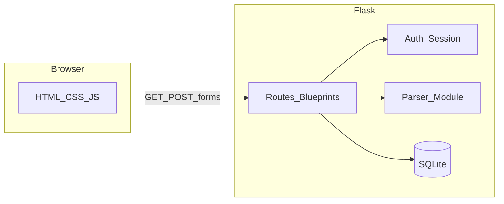

# Technical Design Document (TDD)

**Project:** Smart Job Tracker  
**Pattern:** Server-rendered multi-page application (MPA), not a SPA

---

## 1. Architecture overview

A single Flask process handles HTTP. The browser submits forms and follows redirects (POST/Redirect/GET). **No** client-side router; **no** REST API requirement for MVP (you may still use JSON later if you choose—unnecessary for scope).

---

## 2. Tech stack justification

| Layer | Choice | Rationale |
|-------|--------|-----------|
| Web framework | Flask | Small surface area, excellent PythonAnywhere WSGI support, blueprints keep student projects organized. |
| Database | SQLite | No separate DB server; file in `instance/`; satisfies “database-driven” and normalization exercises. |
| Data access | Flask-SQLAlchemy (recommended) | FK relationships, migrations-by-hand still possible; reduces SQL injection footguns vs. ad hoc strings. Raw `sqlite3` acceptable if the course mandates visible SQL—then centralize queries in a small module. |
| Templates | Jinja2 | Built into Flask; inheritance for `base.html`. |
| Forms / CSRF | Flask-WTF (recommended) | CSRF tokens and field validation with minimal code. |
| Auth | Flask-Login + Werkzeug password hashing | Standard session cookie model; `User` model implements `UserMixin`. |

**Explicitly excluded:** React/Vue, PostgreSQL, Redis, Celery, external ML APIs, Docker (not required for PA).

---

## 3. Backend design

### 3.1 Application factory

- `create_app(config_name)` constructs the Flask app, loads `SECRET_KEY` and `SQLALCHEMY_DATABASE_URI` from environment or config class.
- Register blueprints: `auth`, `companies`, `applications`, `parser` (names may vary).
- Initialize extensions: `db`, `login_manager`, `csrf` (if using Flask-WTF).

### 3.2 Layering

- **Routes:** HTTP only—parse form data, call small helpers, commit/rollback, flash messages, redirect.
- **Models:** SQLAlchemy classes mirroring [database-design.md](database-design.md).
- **Services:** `parser_service.py` contains **pure functions** (no Flask imports): `(text, input_type) → structured result` for unit testing and clear “rules” documentation.

### 3.3 Multi-tenancy (logical)

Every query for mutable data includes a filter on the authenticated user’s id (`user_id` on `companies`, `applications`, `parsed_inputs`). **Never** trust a `user_id` submitted from a hidden form field for authorization—derive ownership from the session and re-check on each request.

---

## 4. Frontend design

- **`templates/base.html`:** Navigation (login/register vs. app links), flash message region, ``.
- **CSS:** Single stylesheet `static/css/app.css` (or split by page if you prefer—keep it small).
- **JS:** `static/js/app.js` for optional UX: confirm before delete, expand/collapse raw paste on review page. **Server remains authoritative** for validation.

---

## 5. Data flow — manual application create

1. User completes form (company, title, status, optional fields).
2. POST to server; validate.
3. **Single transaction:** INSERT `applications`; INSERT `application_status_history` with the **same** `status_id` as `current_status_id`, `source_parse_id` NULL.
4. Redirect GET to application detail (PRG).

---

## 6. Data flow — parsing (preview and confirm)

### Recommended approach (session preview)

1. **GET** `/parser` — paste form (`input_type`, `raw_text` empty).
2. **POST** `/parser/preview` — run `parser_service`; store **proposed** structured dict in **server session** (not in `applications` yet). Render review template with editable fields.
3. **POST** `/parser/confirm` — read edited values from form; in one transaction: optionally create/find company; INSERT `applications` + initial history; optionally INSERT `parsed_inputs` for audit; set `source_parse_id` on the new history row if you log parses.

**Why session for preview:** Avoids orphan `parsed_inputs` rows when users abandon the flow.

### Alternative (draft rows)

INSERT `parsed_inputs` with `confirmed_at` NULL on preview; DELETE or mark abandoned rows on cleanup. More moving parts; use only if you need durable drafts.

---

## 7. Deployment — PythonAnywhere

1. Upload project; create virtualenv; `pip install -r requirements.txt`.
2. **WSGI** file imports `create_app()` from your package (adjust `sys.path` if needed).
3. **Static files:** Map `/static/` to your project’s `static/` directory in PA web config.
4. **Database:** Path under `/home/<user>/.../instance/jobtracker.db` with write permissions.
5. **Environment:** Set `SECRET_KEY`, disable Flask debug, set `SESSION_COOKIE_SECURE=True` when using HTTPS.
6. Run **init** script once after deploy to create tables and seed statuses.

---

## 8. Security basics (student-appropriate)

| Topic | Practice |
|-------|----------|
| Passwords | `generate_password_hash` / `check_password_hash`; never log or store plaintext. |
| Sessions | HttpOnly cookies; secure flag in production. |
| CSRF | Flask-WTF on all POST forms that mutate data. |
| SQLi | ORM or bound parameters only. |
| Authorization | For any `:id` route, load row and assert `row.user_id == current_user.id` (or join through parent application). |

---

## 9. Risks and tradeoffs

| Risk | Mitigation |
|------|------------|
| SQLite concurrent writes | Acceptable for demo and light personal use; keep transactions short. |
| Parser wrong fields | Mandatory review + editable fields; optional “rule hit” hints in UI for explainability. |
| Session size (large paste) | Store only **extracted** fields in session after preview, not necessarily full multi-KB raw text—or truncate stored raw for audit table only on confirm. |
| Scope creep | Defer “match existing application from email” until new-application-from-paste is solid. |
