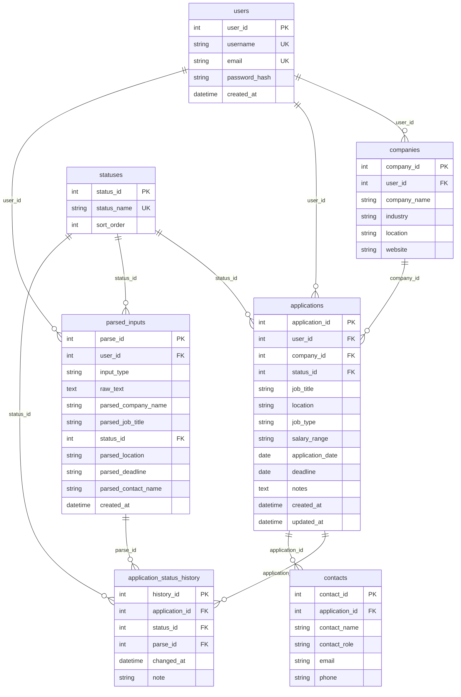

# Entity-Relationship Diagram (ERD) Specification

**Project:** Smart Job Tracker

---

## 1. Text ERD (Crow’s foot style)

```
users ||--o{ companies : "owns (user_id)"
users ||--o{ applications : "owns (user_id)"
users ||--o{ parsed_inputs : "creates (user_id)"
companies ||--o{ applications : "has (company_id)"
statuses ||--o{ parsed_inputs : "parsed_suggestion (status_id)"
statuses ||--o{ applications : "current_status (status_id)"
statuses ||--o{ application_status_history : "transition (status_id)"
applications ||--o{ application_status_history : "has_history (application_id)"
applications ||--o{ contacts : "has_contact (application_id)"
parsed_inputs ||--o{ application_status_history : "may_source (parse_id)"
```

Reading guide: `||` = exactly one on the parent side; `o{` = zero or many on the child side.

---

## 2. Mermaid ER diagram

Render in GitHub, VS Code (Mermaid preview), or export for your report.



---

## 3. Plain-English relationship explanations

- **User → Companies (one-to-many):** Each account maintains its own list of employer records. Two different users can both have a company named “Acme” without sharing the same row.

- **User → Applications (one-to-many):** Every application belongs to exactly one user. Combined with `company_id`, the app enforces that the chosen company also belongs to that user.

- **Company → Applications (one-to-many):** The same company row can be referenced by many applications over time (e.g. reapplied next season).

- **Status → Applications (one-to-many):** Many applications share the same current status label (Applied, Interviewing, etc.) via `applications.status_id` (same name as `statuses.status_id`).

- **Application → Status history (one-to-many):** Each status transition adds a row. The timeline answers “when did I move to Interviewing?”

- **Status → Status history (one-to-many):** The lookup table normalizes status names; history rows store foreign keys, not duplicate strings.

- **Application → Contacts (one-to-many):** Recruiters or hiring managers are tied to a specific application.

- **User → Parsed inputs (one-to-many):** Audit trail of what was pasted and what was extracted (on confirm), scoped per user.

- **Parsed input → Status history (one-to-many, optional):** If a confirmed parse caused a status change, `application_status_history.parse_id` links the history row back to that parse for traceability. Manual status changes leave `parse_id` NULL.

---

## 4. Cardinality table (every relationship)

| Parent entity | Child entity | Parent cardinality | Child cardinality | FK on child |
|---------------|--------------|--------------------|-------------------|-------------|
| users | companies | 1 | 0..N | `companies.user_id` |
| users | applications | 1 | 0..N | `applications.user_id` |
| users | parsed_inputs | 1 | 0..N | `parsed_inputs.user_id` |
| companies | applications | 1 | 0..N | `applications.company_id` |
| statuses | applications | 1 | 0..N | `applications.status_id` |
| applications | application_status_history | 1 | 1..N (after first save) | `application_status_history.application_id` |
| statuses | application_status_history | 1 | 0..N | `application_status_history.status_id` |
| applications | contacts | 1 | 0..N | `contacts.application_id` |
| parsed_inputs | application_status_history | 1 | 0..N | `application_status_history.parse_id` (nullable) |

**Note:** A brand-new application might be created with exactly **one** initial history row; from a data lifecycle perspective you enforce “always at least one history row matching current status” in application code.
