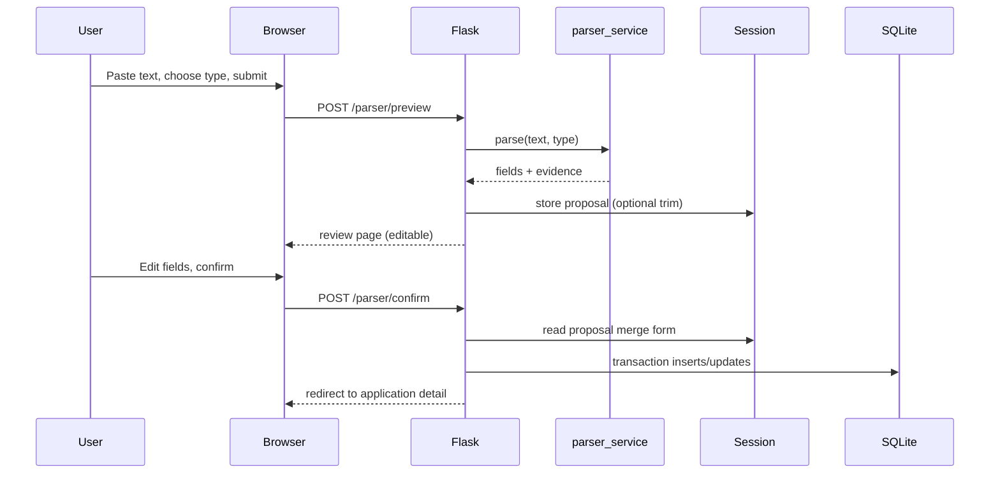

# Parsing Design Document

**Project:** Smart Job Tracker  
**Approach:** Deterministic **rule-based** extraction (regular expressions + keyword rules). **No** machine learning or external NLP APIs for MVP.

---

## 1. Goals and non-goals

**Goals**

- Reduce manual typing for common job posting and email patterns.
- Produce a **structured proposal** (company, title, location, deadline, suggested status, contact hint).
- Support a **review** step where the user edits everything before save.

**Non-goals**

- Perfect accuracy on all formats.
- Automatic linking to the correct existing application without user confirmation (optional phase 2).
- Parsing PDF or binary attachments (text paste only).

---

## 2. Input types

| `input_type` value | Typical source | Parser emphasis |
|--------------------|----------------|-----------------|
| `job_listing` | Careers page text, job board copy-paste | Title, company, location, deadline, job type, salary |
| `email` | Recruiter / HR email pasted as plain text | Status-relevant phrases, company hint, contact line, subject line |

Implement as a string discriminator with server-side validation (allowlist).

---

## 3. Job listing parsing

### 3.1 Strategy

Process the text in **stages**. Each stage appends to a result object and optionally records **evidence** (which substring triggered which rule) for the review UI or your technical appendix.

1. **Normalize** input: unify newlines, collapse excessive spaces (careful not to destroy structure).
2. **Line-based heuristics:** First N lines often contain title or company in informal postings.
3. **Label-driven extraction:** Look for labels such as `Company:`, `Employer:`, `Role:`, `Position:`, `Location:`, `Job Type:`.
4. **Pattern-driven extraction:** Dates, salary bands, “Remote / Hybrid / On-site”.

### 3.2 Field-specific ideas

| Field | Rule ideas (examples—not exhaustive) |
|-------|--------------------------------------|
| **Company** | Regex `(?i)^(?:company|employer)\s*:\s*(.+)$` per line; fallback: line after “at ” in title line |
| **Job title** | Lines containing intern/engineer/analyst/manager **or** label `Title:` / `Role:` |
| **Location** | Keywords `Remote`, `Hybrid`, `On-site`; pattern `City, ST` (two-letter state); `Multiple locations` |
| **Deadline** | Phrases `apply by`, `closing date`, `deadline`; date regex `\b\d{1,2}[/-]\d{1,2}[/-]\d{2,4}\b` |
| **Salary** | `\$\d{1,3}(?:,\d{3})*(?:\s*-\s*\$\d{1,3}(?:,\d{3})*)?` or `\d{2,3}k` bands |
| **Job type** | Keyword map: internship, co-op, full-time, full time, part-time, contract |

### 3.3 Output shape (recommended)

Return a dictionary such as:

```text
fields: { company_name, job_title, location, deadline, job_type, salary_range, ... }
evidence: [ { field, rule_id, matched_text } ]
```

Empty or missing fields are valid; the review form uses blanks.

---

## 4. Email parsing

### 4.1 Structure

1. Split **headers** if user pasted `From:`, `To:`, `Subject:` lines.
2. Run **status rules** on **subject + body** (case-insensitive).
3. Extract **contact** from `From:` line or closing `Best regards, Name`.
4. Extract **company** from domain `...@company.com` (strip generic providers: gmail, yahoo, outlook) or phrases `on behalf of X`.

### 4.2 Status phrase mapping (keyword → status name)

Use **ordered** rules: first strong match wins (document order in code comments).

| Suggested status | Example phrases / cues |
|------------------|-------------------------|
| Rejected | `unfortunately`, `not selected`, `moving forward with other candidates`, `decided to pursue other candidates` |
| Offer | `offer of employment`, `pleased to offer`, `compensation package`, `signing bonus` (combine carefully to avoid false positives) |
| Interviewing | `schedule`, `interview`, `phone screen`, `video call`, `meet with the team` |
| OA | `online assessment`, `hackerrank`, `codility`, `oa`, `take-home` |
| Applied | `application received`, `we received your application` |
| Withdrawn | (Usually user-driven; optional weak cues—often skip auto map) |

**Caution:** Single words like `offer` can false-positive in rejection emails (“we cannot offer you”). Prefer multi-word patterns or negative guards (e.g. if rejection phrase matched, do not map Offer).

### 4.3 Email output

Same `fields` + `evidence` structure; `parsed_inputs.status_id` may be NULL if no rule fires.

---

## 5. Review and confirmation flow



**UI elements on review**

- Editable text inputs for all mapped fields.
- Dropdown for **existing company** + optional inline “create new company name.”
- Dropdown for **status** (pre-selected from parser suggestion if present).
- Collapsible panel showing **original raw text** (read-only).
- Optional list of **matched rules** (helps class demo / explainability).

**On confirm**

- Resolve `company_id` (pick existing or create).
- INSERT `applications` + initial `application_status_history` **or** if phase 2: UPDATE existing app + append history only.
- INSERT `parsed_inputs` row if auditing; set `parse_id` on new history row when applicable.
- Clear session preview payload.

---

## 6. Limitations (document for graders)

- English-centric templates; bilingual emails may misfire.
- Unusual formatting (PDF-to-text garbage) breaks line-based rules.
- Same boilerplate for many employers can misidentify company.
- Status inference from email is **heuristic**; users must confirm.

---

## 7. Testing approach

- Maintain **3–5** fixed strings in `tests/` or in [starter-assets-and-fixtures.md](starter-assets-and-fixtures.md).
- After changing a rule, rerun tests; parser regressions are easy to introduce.

---

## 8. Optional phase 2 — match existing application

**Heuristic (example):** Among current user’s applications, score by:

- Normalized company name similarity (edit distance or containment).
- Title token overlap.

Present top 3 suggestions on review page; default to **new application** unless user picks one. **Only append** `application_status_history` when updating existing.
