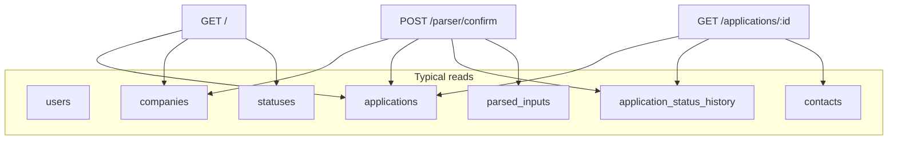

# Route and Page Map

**Project:** Smart Job Tracker  
**Convention:** Destructive or mutating actions use **POST** with CSRF protection. Use **POST/Redirect/GET** after successful mutations.

URL paths below are **suggested**; you may rename for style (e.g. `/auth/login` vs `/login`) as long as behavior matches the PRD.

---

## 1. Public pages (unauthenticated)

| Route | Methods | Page / purpose | Reads | Writes |
|-------|---------|----------------|-------|--------|
| `/register` | GET, POST | Registration form; create account | — on GET | `users` on POST |
| `/login` | GET, POST | Login form | `users` (lookup) | session on POST |

Optional: `/` redirects to `/login` when anonymous, or shows a marketing one-liner with links to register/login.

---

## 2. Authenticated pages

Assume `@login_required` (or equivalent) for all routes in this section.

### 2.1 Dashboard / home

| Route | Methods | Page / purpose | Reads | Writes |
|-------|---------|----------------|-------|--------|
| `/` | GET | Application list (dashboard); links to create, parser, companies | `applications` (+ `companies`, `statuses` for display) | — |

Optional query params: `?status_id=`, `?company_id=` for simple filters.

---

### 2.2 Auth session

| Route | Methods | Page / purpose | Reads | Writes |
|-------|---------|----------------|-------|--------|
| `/logout` | POST | End session | — | session cleared |

Use a form button or JS-assisted POST; avoid GET logout (crawler prefetch risk).

---

### 2.3 Companies

| Route | Methods | Page / purpose | Reads | Writes |
|-------|---------|----------------|-------|--------|
| `/companies` | GET | List user’s companies | `companies` WHERE `user_id` | — |
| `/companies/new` | GET, POST | Create company | — on GET | `companies` on POST |
| `/companies/<int:id>/edit` | GET, POST | Edit company | one `company` if owned | `companies` on POST |
| `/companies/<int:id>/delete` | POST | Delete company | one `company` if owned | `companies`; **block** or CASCADE if applications exist (your choice—document it) |

---

### 2.4 Applications

| Route | Methods | Page / purpose | Reads | Writes |
|-------|---------|----------------|-------|--------|
| `/applications` | GET | List applications (optional filters) | `applications`, joins | — |
| `/applications/new` | GET, POST | Manual create | `companies`, `statuses` | `applications` + first `application_status_history` |
| `/applications/<int:id>` | GET | Detail: fields, timeline, contacts | app, history, contacts, statuses | — |
| `/applications/<int:id>/edit` | GET, POST | Edit non-status fields (or all fields—your UX choice) | app if owned | `applications` |
| `/applications/<int:id>/status` | POST | Change status | app if owned | INSERT `application_status_history`; UPDATE `applications.status_id` |
| `/applications/<int:id>/delete` | POST | Delete application | app if owned | DELETE app (cascade contacts/history) |

---

### 2.5 Contacts

Contacts may live under `/applications/<app_id>/contacts/...` **or** flat `/contacts/...` with strict parent checks. Both are valid.

| Route | Methods | Page / purpose | Reads | Writes |
|-------|---------|----------------|-------|--------|
| `/applications/<int:app_id>/contacts/new` | GET, POST | Add contact | application if owned | `contacts` |
| `/contacts/<int:id>/edit` | GET, POST | Edit contact | contact → application → user | `contacts` |
| `/contacts/<int:id>/delete` | POST | Delete contact | same chain | `contacts` |

---

### 2.6 Parser

| Route | Methods | Page / purpose | Reads | Writes |
|-------|---------|----------------|-------|--------|
| `/parser` | GET | Paste form: `input_type`, empty `raw_text` | — | — |
| `/parser/preview` | POST | Run parser; show review | session (after write) | **No** core writes; optionally no DB at all (session only) |
| `/parser/confirm` | POST | Persist after user edits | session + form | `companies` (if new), `applications`, `application_status_history`, optionally `parsed_inputs` |

**Critical:** `preview` must not insert into `applications`. Only `confirm` does.

---

## 3. Data each route touches (summary diagram)

---

## 4. Error handling expectations

- **404:** Resource id not found **or** not owned by `current_user`.
- **403:** Rare if you fold permission into 404; either is acceptable if documented.
- **400/422:** Validation errors; re-render form with flashes.
- **500:** Log server-side; user sees generic error in production (debug off).

---

## 5. Optional routes (phase 2)

| Route | Purpose |
|-------|---------|
| `/parser/match` | Show ranked application suggestions for email paste |
| `/export/applications.csv` | Download CSV of user’s applications |
